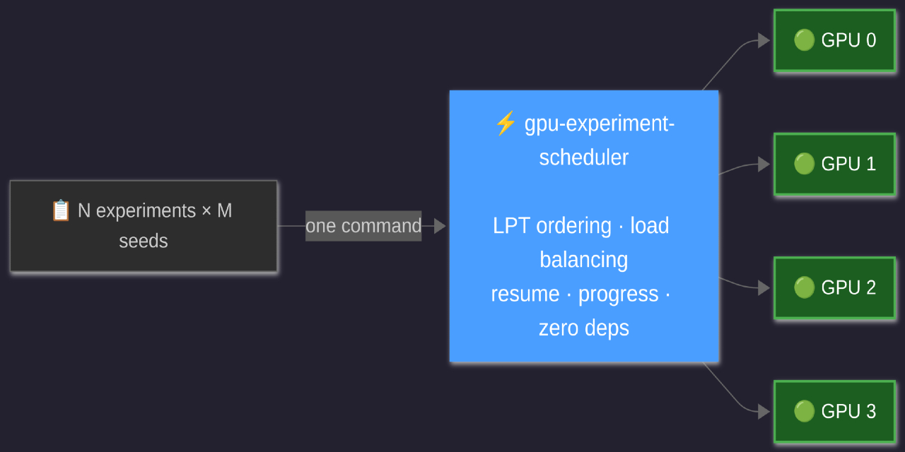

# gpu-experiment-scheduler



Lightweight single-node multi-GPU experiment scheduler for Python ML research.
Zero dependencies (stdlib only), copy-paste ready.

Schedules a `name * seed` task matrix across multiple GPUs on one machine
using **LPT ordering** (heavy tasks first) and **load-aware dispatch**
(idle GPU with the smallest active workload gets the next task).

## When to use

| Situation                                         | Tool                 |
| ------------------------------------------------- | -------------------- |
| 1 machine, 2-8 GPUs, need to run N\*M experiments | **lab-orchestrator** |
| SLURM cluster available                           | Hydra + Submitit     |
| Hyperparameter search with Bayesian optimisation  | Ray Tune / Optuna    |
| Shared multi-user workstation with job queuing    | gflow                |
| Just need experiment tracking                     | MLflow / W&B         |

## Install

```bash
# From source (editable), run from the repo root:
pip install -e .

# Or just copy lab_orchestrator/ into your project - zero dependencies.
```

## Quick start

### 1. Programmatic (recommended for research repos)

> **Tip:** `weight` is estimated GPU-hours per task. For a first run use
> `weight=1.0` for everything - LPT still helps. Replace with actual
> wall-clock hours from logs once you have them.

```python
from lab_orchestrator import Task, run_schedule, detect_gpus

tasks = [
    Task(weight=2.0, name="big", seed=42,            # weight ~= GPU-hours; use 1.0 if unknown
         cmd=["python", "train.py", "--config=big", "--seed=42"]),
    Task(weight=2.0, name="big", seed=43,
         cmd=["python", "train.py", "--config=big", "--seed=43"]),
    Task(weight=0.5, name="small", seed=42,
         cmd=["python", "train.py", "--config=small", "--seed=42"]),
]

run_schedule(detect_gpus(), tasks, workers_per_gpu=2)
```

### 2. With task matrix builder

```python
from lab_orchestrator import build_task_matrix, run_schedule, detect_gpus

weights = {"big": 2.0, "small": 0.5}

def make_cmd(name, seed):
    return ["python", "train.py", f"--config={name}", f"--seed={seed}"]

tasks = build_task_matrix(
    names=["big", "small"],
    seeds=[42, 43, 44],
    weights=weights,
    cmd_factory=make_cmd,
)

run_schedule(detect_gpus(), tasks)
```

### 3. Config file (YAML)

```yaml
# experiments.yaml
names: [memorization, masked_instability, temporal_limit]
seeds: [42, 43, 44, 45, 46]
weights:
  memorization: 6.5
  masked_instability: 1.7
  temporal_limit: 7.3
cmd_template: "python main.py {name} --seed {seed} --epochs 50"
```

> Replace `main.py` with your training script. See `examples/sweep/`
> for a working config that pairs with a training script.

```bash
python -m lab_orchestrator experiments.yaml --gpus 0,1,2,3
python -m lab_orchestrator experiments.yaml --dry-run
python -m lab_orchestrator experiments.yaml --resume
```

### 4. tmux mode

Useful when you want to attach/detach from running experiments or
monitor individual tasks in real time (one tmux window per task).

Generate a tmux script instead of running programmatically:

```bash
python -m lab_orchestrator experiments.yaml \
    --tmux --tmux-session my_exp \
    --venv "source .venv/bin/activate" \
    --cwd /path/to/experiment \
    > run_tmux.sh

bash run_tmux.sh
tmux attach -t my_exp
```

## Examples

```
examples/
├-- sklearn_digits/            # minimal working example (no GPU needed)
│   ├-- train.py               # fits one model for one seed
│   └-- launch.py              # schedules 3 models * 5 seeds
├-- sweep/                     # GPU sweep template with YAML config
│   ├-- train.py               # training script (the "worker")
│   ├-- sweep.py               # programmatic launcher
│   └-- experiments.yaml       # same sweep as a YAML config for the CLI
├-- experiment_template.py     # (advanced) launcher + training in one file
└-- tmux_example.py            # generates a tmux bash script
```

Try the sklearn example right away (no GPU needed).
`--gpus 0` creates one subprocess pool - no real GPU required, sklearn
ignores `CUDA_VISIBLE_DEVICES`:

```bash
pip install -e .                               # install lab-orchestrator
cd examples/sklearn_digits
python launch.py --gpus 0 --dry-run            # preview the 15-task schedule
python launch.py --gpus 0                      # run all 3 models * 5 seeds
python launch.py --gpus 0 --resume             # skip already-finished seeds
python train.py --name svm --seed 42           # run a single model/seed
```

## Features

- **LPT scheduling** - heavy tasks start first, short ones fill gaps
- **Load-aware dispatch** - each new task goes to the least-loaded GPU
- **Per-GPU worker pools** - overlap CPU-bound work with GPU kernels (default: 1, safe for any model; raise to 2 when your model leaves GPU memory headroom and preprocessing is CPU-bound)
- **Resume** - skip tasks whose `seed_*.json` already exists
- **Dry-run** - preview the schedule without executing
- **Progress tracking** - ETA with `[done/total pct%]` in every log line
- **Subprocess isolation** - each task is a separate process with its own `CUDA_VISIBLE_DEVICES`
- **tmux generation** - alternative to programmatic dispatch
- **Zero dependencies** - stdlib `multiprocessing` + `subprocess` only

## Architecture

```
┌----------------------------------------------┐
│  Main process (dispatcher)                   │
│                                              │
│  task_pool --LPT--->  least-loaded GPU queue │
│                                              │
│  result_queue <- READY / START / DONE msgs   │
├----------┬----------┬----------┬-------------┤
│ GPU 0    │ GPU 1    │ GPU 2    │ GPU 3       │
│ worker_0 │ worker_0 │ worker_0 │ worker_0    │
│ worker_1 │ worker_1 │ worker_1 │ worker_1    │
│ (queue)  │ (queue)  │ (queue)  │ (queue)     │
└----------┴----------┴----------┴-------------┘
```

Workers pull from their GPU-specific queue and run tasks as subprocesses.
The dispatcher monitors the result queue, tracks per-GPU active weight,
and assigns the next task to the GPU with the smallest total in-flight weight.

## Weight calibration

Task weights represent estimated GPU-hours under exclusive single-worker
access. If you ran experiments with N workers per GPU sharing contention,
decode exclusive time via:

$$T_{\text{exclusive}} = \frac{T_{\text{observed}}}{N^{\alpha}}$$

where α ~= 0.4-0.5 for typical DL workloads (memory-bandwidth bound).

## License

MIT License (see [LICENSE](LICENSE)).

# Also

Contributions are very welcome! Open an issue or a PR if you have suggestions or want to add features.
